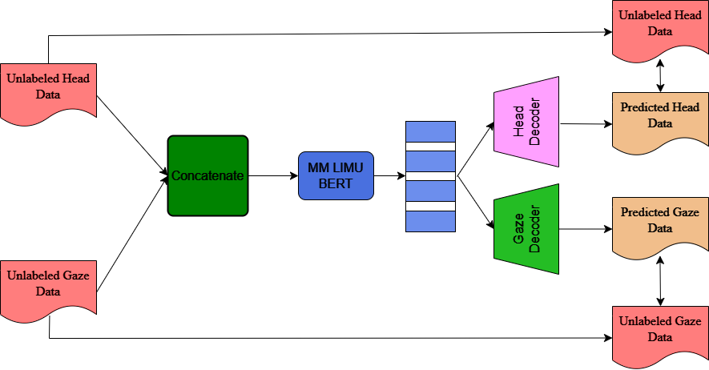
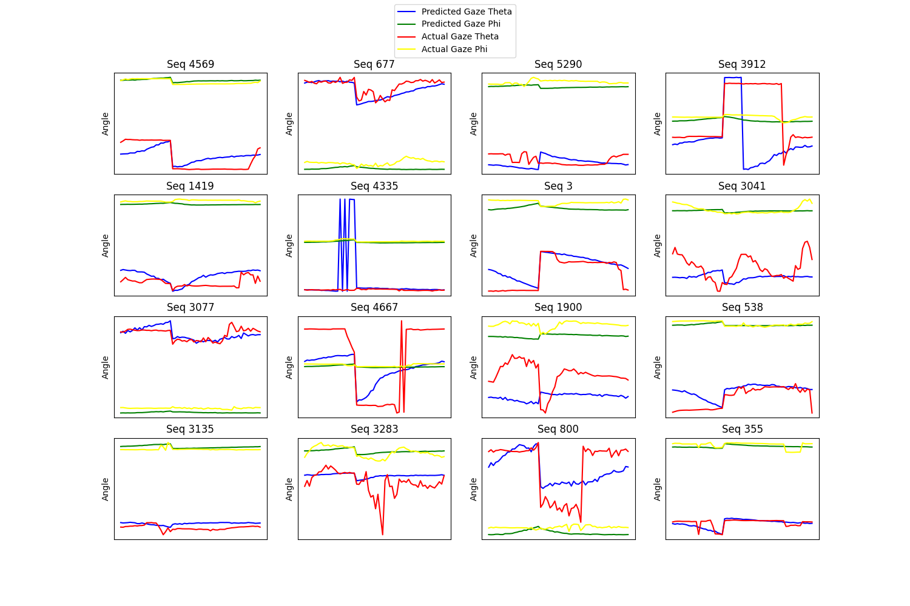
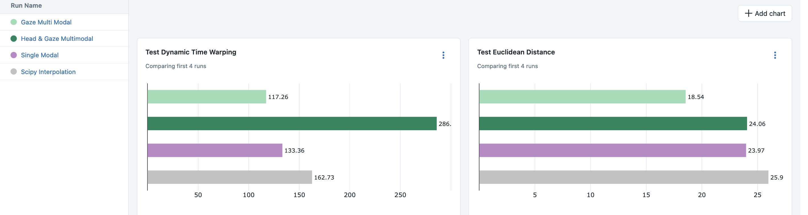

# Head and Gaze Joint Representation Learning
In eye tracking systems, missing values in gaze data due to blinks, pupil detection failures, make the data unsuitable for analysis and downstream tasks. 
- Head movements and eye movements are correlated. No missing values from head tracking sensors. 
- Can we use the head information in filling the missing gaze?

## Objectives
- Build a multi-modal Masked Auto Encoder for gaze-head joint representation learning following state-of-the-art methods.
- Evaluate the method of filling the missing gaze samples, increasing data efficiency, and increasing the performance of down-stream tasks.

### State of the Arts
- [LIMU-BERT](https://github.com/dapowan/LIMU-BERT-Public) is a novel representation learning model that can make use of unlabeled IMU data and extract generalized rather than task-specific features. 
-  LIMU-BERT adopts the principle of natural language model BERT to effectively capture temporal relations and feature distributions in IMU sensor data. 
- With the representations learned via LIMU-BERT, task-specific models trained with limited labeled samples can achieve superior performances. 

## Dataset
- [Head and Gaze Behavior Dataset](https://cuhksz-inml.github.io/head_gaze_dataset/) contains nearly 20 million frames of Head and Gaze tracking data. A large-scale dataset includes 100 users and 27 video sequences. A rich diversity of videos under 3 dimensions.

## Methodology
The Masked Language Model (MLM) task involves masking
individual tokens in a sequence and training the model to predict the masked tokens based on the surrounding context.
- This work adapts the LIMU-BERT model architecture, which was originally designed for a single modality. 
- It extends the model to support multiple modalities to account for head and gaze, respectively.

## Codebase

### Gaze Multi-Modal Architecture
- Learns a joint representation and reconstructs both gaze and head data.
- `python LIMU-BERT-Public/hg_pretrain.py v3 hgbd 2 -s limu_v1 -g 0 -mt gaze_mm`

### Gaze Single-Modal Architecture
- Learns a joint representation and reconstructs only gaze data.
- `python LIMU-BERT-Public/hg_pretrain.py v3 hgbd 2 -s limu_v1 -g 0 -mt gaze`

### Scipy Interpolation
- Run a baseline model using scipy interpolation.
- `python LIMU-BERT-Public/baseline.py v3 hgbd 2 -s limu_v1 -g 0`

## Results
Reconstruction of Gaze data using the learnt joint distribution on test dataset is shown below.

Comparison of Model Performance against the baselines is shown below,

